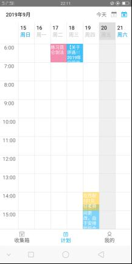

# 一、作品概述
&emsp;&emsp;随着信息技术的发展，当前人们主要通过各种通讯软件如微信、QQ等接收各种通知类文本信息，并据此安排生活日程。但目前大多数日程管理软件不能自动提取这些文本中的时间和地点等主要信息，或者提取的精度不高，难以满足大多数用户的需求，为此我们基于安卓系统设计并开发了“日程规划师”app。

&emsp;&emsp;我们本次开发的“日程规划师”app以智能、便捷、高效为主要特点，基于文本挖掘技术实现通知类文本中时间地点等信息的自动提取，帮助用户合理的规划日程安排。获取用户收到的通知文本后，利用NLPIR-ICTCLAS分词和有穷自动机相结合的方式提取通知地点信息，并利用正则表达式提取时间信息（包括日程的开始时间、结束时间以及重复性），再通过调用高德地图API获取当前地点信息，形成事件提醒的基本三要素（目的地点、当前地点、事件开始时间）。基于这三要素确定提醒时间，帮助用户智能规划日程，合理安排时间，提高日程安排效率。

&emsp;&emsp;与现有的日程app相比，“日程规划师”app不仅可从通知文本中智能提取时间信息和地点信息更加高效地帮助用户规划日程， 还为用户提供了导航功能，帮助用户更便捷的按日程规划出行路线，节省用户时间。此外“日程规划师”app还提供了不同时间单位的视图（如：周视图、月视图、列表视图等）展示等基本功能，具有较好的人机交互性能。
# 二、作品可行性分析和目标群体
## （1）可行性分析
&emsp;&emsp;从技术可行性分析，“日程规划师”app主要由移动端和服务器两部分构成，移动端采用以Java为开发语言的MVC（Model-View-Controller）架构实现，其中还包括高德地图API的调用。服务器端则使用servlet与移动端进行数据传输，并实现时间信息T和地点信息L1的提取工作。团队成员均熟练掌握Java语言，并具有开发app和搭建服务器的能力。

&emsp;&emsp;从操作可行性分析，“日程规划师”app界面友好，操作简单，任何人都可以很快掌握操作原理并使用。

&emsp;&emsp;从经济可行性分析，除去人力资源成本外，“日程规划师”app每年只需120元的设备开支用于租用阿里云服务器（学生套餐），成本低。
## （2）目标群体
&emsp;&emsp;“日程规划师”目的在于使日程管理更加智能化，减少用户管理日程的时间，提高工作效率。所以本app的主要面向的是需要进行大量日程管理的手机用户，如以下两类：

&emsp;&emsp;1、学生群体，目前大学生拥有丰富的大学生活，学生组织的社团活动已经成为了学生生活的一部分，合理有效的安排自己的日程是生活中基础且必要的一部分。

&emsp;&emsp;2、其他群体，为了保证工作进度或进行工作安排会进行定期或不定期的会议，以及各种类型的通知。
# 三、作品功能与原型设计
## （1）功能概述：
|功能名称|	功能描述|
|------|---|
|智能添加日程|	自动获取粘贴板中的通知并通过算法分析有几个日程，最终将每个日程的发生时间、地点和内容显示并由用户确认/修改日程地点，确认无误后添加日程。|
|手动添加日程|	添加的内容包括日程的时间、地点和内容。|
|日程列表展示|	通过选定时间段，列出该时间段内所有日程的简略版信息，点击列表中的选项即可进入详情页面查看对应日程具体信息。|
|集成日程展示	|把一天内的所有日程在日视图对应的时间段中用符号表示，即周分布和月分布。点击日程对应的时间段进入该时间段日程的详情界面。|
|日程修改|	用户可通过日程的详情界面对日程的时间、地点和内容进行修改。|
|日程导航|	为用户提供当前位置或指定位置到日程中目的地的导航，有步行规划、公交规划和自驾规划三种模式。|
|日程提醒|	在应用运行期间，会为用户对即将发生的日程进行提醒。|
|用户登录/注册|	用户通过注册功能可以拥有自己的账号密码，登录账号后，进入属于自己的日程管理。|

## （2）原型设计
该软件基于安卓平台实现，兼容安卓6.0-9.0的手机。推荐使用型号为OPPO R11s Plus的手机进行测试。
“日程规划师”app的作品截图和界面说明见下图：

**图1 自动识别剪切板&emsp;&emsp;&emsp;&emsp;&emsp;&emsp;图2 手动添加日程**

	

### 智能添加日程: 
&emsp;&emsp;  如图1所示。程序会自动检测并分析用户剪切板中的时间、地点信息，自动生成对应事件供用户选择。在确认之前，可以简单对识别出的多地点进行选择，如果不需要地点，则可点击图中的小叉将之删除。
### 手动添加日程: 
&emsp;&emsp; 如图1所示，点击右上角第一个按钮，进入手动添加日程的界面。如图2 所示。输入想要输入的信息后，点击“确定”按钮后，日程将会被识别。
### 日程列表显示:
&emsp;&emsp; 日程被分为三种状态：己完成、未完成、进行中。按照紧迫程度排列成列表形式。每一个列表项简要显示了该日程的简要信息，包括日程摘要、目的地点、提醒状态等。不同状态的日程分别以不同的颜色标识出来。如图1 所示。点击右上角第二个按钮可以更改显示日程的时间范围。

**图3 月视图&emsp;&emsp;&emsp;&emsp;&emsp;&emsp;&emsp;&emsp;图4 周视图**

### 集成日程展示: 

&emsp;&emsp;如图3所示，月视图可以查看每天是否有安排。有事情的一天将会标示一个小圆点。对于过去的日子将以灰色显示，否则以蓝色显示。点击日历上的某个日期后，下方将显示对应日期所有的日程，并按照时间顺序排序。日历可以左右滑动浏览不同的月份。右上方有“今天 ”按钮，点击之后回到今月。中间有一个按钮，点击之后，可以将日历折叠。折叠后能显示更多内容。

&emsp;&emsp;如图4所示，周视图展示了某一周的日程安排，每一列代表一天，每一个日程都被放置在对应的时间区间之中。为了使得日程更好辨认，每个日程的背景色都是固定的随机颜色。图中浅灰色一列代表的是“今天”。

	

**图5 详情&emsp;&emsp;&emsp;&emsp;&emsp;&emsp;&emsp;&emsp;图6 工具菜单**

	

### 日程修改: 
&emsp;&emsp;如图5所示，在此可以对既添加的事件进行编辑。点击右上方“编辑”按钮之后进入编辑模式。更改“开始时间”后，日程“结束时间”自动推后。

### 日程导航: 
&emsp;&emsp;点击图5的“启动导航”按钮或点击图6的“导航”菜单后，会启动导航。若手机中安装了“高德地图”软件，会启动“高德地图”来进行导航，否则会启动内置的导航组件。
	

**图7 提醒&emsp;&emsp;&emsp;&emsp;&emsp;&emsp;&emsp;&emsp;图8 注册**

	

### 日程提醒:
&emsp;&emsp;如图7所示，当软件后台服务检测到有可以提醒的日程时，会发出通知来提醒用户。同时伴有振动和铃声。每分钟会检测一次。软件启动后需等待一分钟才会检测。
用户注册：

&emsp;&emsp;如图6所示。用户可以点击“登录/注册”字样进行登录或注册。用户注册成功后会自动登录，登录后，将显示用户的登录信息，包括用户名和用户手机号、事件完成情况三项。

# 四、作品实现、难点及特色分析
## （1）作品实现及难点

&emsp;&emsp;**地点信息提取：**通知类文本中的地点表达依据不同的用户和工作场所有很大的不确定性，除了已存在于地点库中的地点外，还有许多未知地点，缺乏标准的格式，因此从通知类文本中精确地提取出地点信息具有较高的难度。在“日程规划师”app中，我们采用先分词后提取的方式，通过NLPIR-ICTCLAS分词系统进行分词后，根据地点信息前后词的词性进行地点信息的提取。

&emsp;&emsp;**时间信息提取：**由于通知类文本中的时间表达形式多样化，例如12.9可能代表时间也可能代表其他数字，所以对该类时间提取造成一定难度。针对该难点，其中一种解决方法为，统计该类时间前后所跟字或词，分析何时作为时间表达。

&emsp;&emsp;**日程导航：**在用户手机安装有高德app的情况下可利用高德app进行导航；在没有高德的情况下，有自驾（Driving）动态导航模式。其次，由于应用自带导航功能需要的参数的形式为经纬度坐标，故而需要将经纬度和文本地址之间进行转换。

## （2）特色分析
**时间信息的提取：**与现有的日程app相比在时间信息的提取方面我们做到了以下方面。

+ 实现对重复时间的提取，例如“每周六上午八点、这个月每周六”等，特色在于使用户对重复的事件可以一次性添加，增强人机交互性；
+ 实现对“第一节课、第三四节课”等课程时间的提取，特色在于为校园用户提供更加符合需求的时间提醒。

**日程导航：** “日程规划师”app不仅可以对通知类文本中的时间信息进行提取，也可以对地点信息进行提取，提取出的地点信息一方面可以用于提醒用户日程地点，另一方面也可以在导航中作为目的地点进行使用。

+ 在日程导航中没应用将自动将当前地址作为出发点进行导航。
+ 在获取当前位置中，可以通过GPS 定位和网络定位，通过用户网络状态进行定位方式的自动选择。
+ 高德地图API需要的参数为经纬度坐标，故而需要将文本地址转换为对应的经纬度。
+ 由于动态导航需要大量的实时数据，所以应用调用了高德地图API，只需要将出发地点和目的地点的经纬参数即可调用相关接口实现导航。

# 五、团队介绍和人员分工
**所在学校** 北京林业大学

**团队名称** 智能日程小组

**团队人员及分工**

		队长 杨圆飞 “日程规划师”app主要功能的代码实现
		队员 宋明惠 通知类文本中地点信息提取算法的研究与代码实现
		队员 梁晓珂 通知类文本中时间信息提取算法的研究与代码实现
		队员 徐媛媛 “日程规划师”app中导航功能的代码实现
		队员 朱欣宇 “日程规划师”app页面设计

**指导教师**  田萱

# 六、其他

&emsp;&emsp;由于“日程规划师”进行提取地点信息和时间信息的算法位于云服务器，在使用“日程规划师”app时，请保证网络链接良好并登录/注册账号，以保证功能可以正常使用。

&emsp;&emsp; 开发环境：Tomcat 9 + JDK 1.8 + 安卓Studio 3.5 

&emsp;&emsp; 安卓编译环境：Gradle 3.4.2 + 安卓API 29 （安卓Q）

&emsp;&emsp; 运行环境：安卓 6-9

# 七、致谢

&emsp;&emsp;特别鸣谢NLPIR-ICTCLAS分词系统的支持。